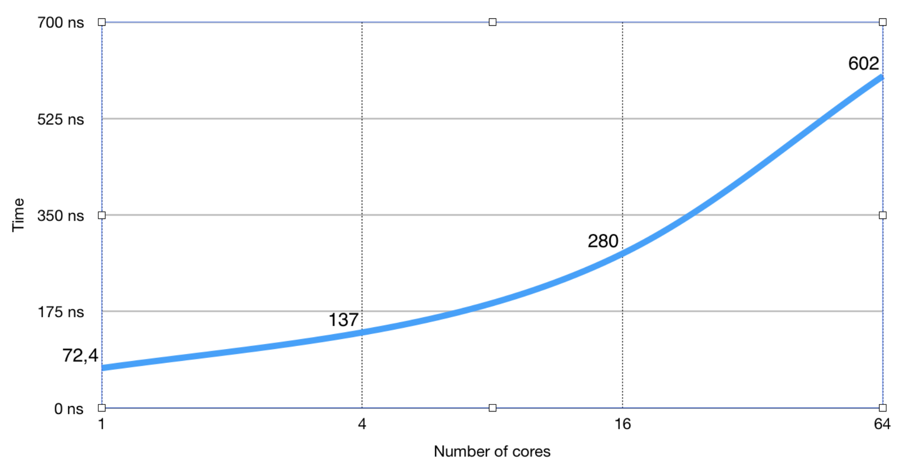

# Урок 9: Примитивы синхронизации

## sync.WaitGroup
**WaitGroup** - механизм для ожидания завершения работы нескольких горутин:
```go
type WaitGroup struct {
  // неэкспортируемые поля
}

func (wg *WaitGroup) Add(delta int)  // инкрементирует счетчик на 1
func (wg *WaitGroup) Done()          // декрементит счетчик на 1
func (wg *WaitGroup) Wait()          // блокируется, пока счетчик не обнулится

// Аргумент Add может быть отрицательным
func (wg *WaitGroup) Done() {
  wg.Add(-1)
}
```

Например:
```go
type Dog struct { name string; walkDuration time.Duration }

func (d Dog) Walk(wg *sync.WaitGroup) {
  defer wg.Done()
  fmt.Printf("%s is taking a walk\n", d.name) 
  time.Sleep(d.walkDuration)
  fmt.Printf("%s is going home\n", d.name)
}

func main() {
  dogs := []Dog{{"vasya", time.Second}, {"john", time.Second*3}}
  var wg sync.WaitGroup

  for _, d := range dogs {
    wg.Add(1)
    go d.Walk(&wg)
  }

  wg.Wait()
  fmt.Println("everybody's home")
}
```

## sync.Mutex
Возьмем для примера следующий код:
```go
var i int // i == 0

// goroutine increment global variable i
func worker(wg *sync.WaitGroup) {
	i = i + 1
	wg.Done()
}

func main() {
	var wg sync.WaitGroup

  runtime.GOMAXPROCS(4)     // Увеличим число ядер до 4

	for i := 0; i < 1000; i++ {
		wg.Add(1)
		go worker(&wg)
	}

	// wait until all 1000 gorutines are done
	wg.Wait()

	// value of i should be 1000
	fmt.Println("value of i after 1000 operations is", i)
}
```

При запуске такой программы мы получим некорректное значение переменной `i`. Это происходит потому, что увеличение
значения переменной происходит в несколько этапов:
1. Читаем из памяти значение
2. Процессор увеличивает его
3. Записываем обновленное значение в память

В некоторых случаях несколько горутин могут одновременно прочитать из памяти одно и тоже значение, обработать его
и записать новое. Но поскольку исходным значением было одно и тоже для нескольких горутин, то фактически мы
пропустим одно увеличение.

```
➜  GOMAXPROCS=4 go run main.go
value of i after 1000 operations is 995
➜  GOMAXPROCS=4 go run main.go
value of i after 1000 operations is 999
➜  GOMAXPROCS=4 go run main.go
value of i after 1000 operations is 992
➜  GOMAXPROCS=2 go run main.go
value of i after 1000 operations is 994
```

Также эту проблему можно отследить при помощи _Race detection_:
```
hello10 go run -race main.go
==================
WARNING: DATA RACE
Read at 0x00000121e868 by goroutine 7: main.worker()
```

Для решения этой проблемы используются **мьютексы** (англ. mutual exclusion - "взаимное исключение") - механизм для
синхронизации одновременно выполняющихся потоков.

```go
type Mutex struct {
  state int32
  sema  uint32
}

// Mutex реализует интерфейс Locker
type Locker interface {
  Lock()
  Unlock()
}
```

Код между `Lock()` и `Unlock()` может исполняться только одной горутиной:
```go
mutex.Lock()
i = i + 1
mutex.Unlock()
```

Если какая-то горутина владеет мьютексом, то новая горутина должна дождаться освобождения мьютекса этой горутиной.

### Mutex: Best Practice
1. Помещайте мьютекс выше тех полей, доступ к которым он будет защищать (codestyle):
```go
var sum struct {
  sync.Mutex      // этот мьютекс защищает
  i int           // поле под ним
}
```

2. Держите блокировку не дольше, чем требуется:
```go
func doSomething() {
  mu.Lock()
  item := cache["myKey"]
  http.Get()    // какой-нибудь дорогой IO-вызов
  mu.Unlock()
}
```

3. Используйте `defer`, чтобы разблокировать мьютекс там, где у функции есть несколько точек выхода:
```go
func doSomething() {
  mu.Lock()
  defer mu.Unlock()

  err := ...
  if err != nil {
    return
  }

  err = ...
  if err != nil {
    return
  }

  return
}
```

4. Будьте аккуратным и внимательным:
```go
func doSomething() {
  for {
    mu.Lock()
    defer mu.Unlock()
    // какой-нибудь интересный код
    // <-- defer будет выполнен не здесь в цикле, а только при выходе из функции doSomething()
  }
}
// И поэтому в коде выше будет дедлок!
```

### Когда использовать каналы и мьютексы
Каналы используются:
* для передачи данных
* при распределении вычислений
* при передаче асинхронных результатов

Мьютексы используются:
* для реализации кэшей
* для реализации состояния

Как быть в таком случае:
```go
var wg sync.WaitGroup
m := make(map[string]int)

for x := 0; x < 12; x++ {
	wg.Add(1)
	go func(wg *sync.WaitGroup) {
		defer wg.Done()
		m["hello"] = 1
	}(&wg)
}
wg.Wait()

// Output:
// fatal error: concurrent map writes
```

Попробуем мьютекс:
```go
type Counters struct {
	mx sync.Mutex
	m map[string]int
}

func (c *Counters) Load(key string) (int, bool) {
	c.mx.Lock()
	defer c.mx.Unlock()
	val, ok := c.m[key]
	return val, ok
}

func (c *Counters) Store(key string, value int) {
	c.mx.Lock()
	defer c.mx.Unlock()
	c.m[key] = value
}
```

`defer` имеет небольшой оверхед (порядка 50-100 наносекунд), поэтому если у вас код для высоконагруженной системы
и 100 наносекунд имеют значение, то вам может быть выгоднее не использовать его.

Методы `Get()` и `Store()` должны быть определены для указателя на `Counters`, потому что в противном случае значение
ресивера `(c Counter)` копируется, а вместе с ним копируется и мьютекс в нашей структуре, что лишает всю затею
смысла и приводит к проблемам.

## sync.RWMutex
Доступ к данным часто неравномерный. К примеру, мы редко пишем и много читаем. В таком случае, можно не блокировать чтение:
```go
type RWMutex struct {
	// Contains filtered or unexported fields
}

func (rw *RWMutex) RLock()      // Блокирует на чтение, другие горутины могут читать
func (rw *RWMutex) RUnlock()
```

RWMutex - стандартное решение для map (см. пример выше):
```go
type Counters struct {
	mx sync.RWMutex
	m  map[string]int
}

func (c *Counters) Load(key string) (int, bool) {
	c.mx.RLock()
	defer c.mx.RUnlock()
	val, ok := c.m[key]
	return val, ok
}
```

**Проблема:** Cache contention
При блокировке на чтение каждое ядро обновляет свой внутренний счетчик. Следующие ядра вычитывают значение для
синхронизации из кэша предыдущего ядра. При наличиях большого числа ядер предложенное выше решение может существенно
снизить производительность.



В таком случае на помощь приходит `sync.Map`. Он входит в стандартную библиотеку с версии 1.9.  
Полезные ссылки:
* [Видео конференции с разбором](https://www.youtube.com/watch?v=C1EtfDnsdDs)
* [Разбираемся с новым sync.Map в Go 1.9 / Хабр](https://habr.com/ru/post/338718/)

## sync.Pool
**Pool** - хранилище временных объектов, безопасное для использования несколькими горутинами. Он позволяет экономить
время при инициализации объектов.

```go
type Pool struct {
	// New - функция, которая возвращает значение
	// если Get() возвращает nil
	New func() interface{}
}

func (p *Pool) Get() interface{}
func (p *Pool) Put(x interface{})
```

Пример работы:
```go
type Dog struct { Name string }
func (d *Dog) Bark() { fmt.Printf("%s", d.Name) }

var dogPack = sync.Pool{
	New: func() interface{} { return &Dog{} },
}

func main() {
	dog := dogPack.Get().(*Dog)
	dog.Name = "Rex"
	dog.Bark()
	dogPack.Put(dog)
}
```

Как это может быть применимо в жизни? Например, у нас есть сервис, который принимает JSON и переводи его в большую
структуру. Каждый раз инициализировать новую структуру накладно, поскольку выделение памяти - это дорогая операция.
В таком случае мы заранее можем подготовить пул из таких структур и просто заполнять их. Главное не забывать их очистить
 перед возвратом обратно в пул. Не путать с пулом соединений БД.

**Важно!** Любой элемент, хранящийся в пуле, может быть удален GC автоматически в любое время без уведомления. И из-за
этого могут возникнуть проблемы с производительностью. Более детально это разобрали
в статье [Go: понять дизайн Sync.Pool](https://dev-gang.ru/article/go-ponjat-dizain-syncpool-cpvecztx8e/).

Итого, Pool:
* набор временных объектов, которыми можно пользоваться (достать, создать и класть назад) независимо
* может использоваться несколькими горутинами
* у нас нет гарантии времени жизни объекта
* снижает время на выделение памяти под объект
* нагружает GC

## sync.Once
Выполняет переданную функцию только один раз, не важно сколько раз она была вызвана. Например, мы через него можем
загрузить конфиг в сервис.

```go
type Once struct {
	m	 Mutex
	done uint32
}

func (o *Once) Do(f func()) {
	if atomic.LoadUint32(&o.done) == 1 {
		return
	}

	// Slow-path
	o.m.Lock()
	defer o.m.Unlock()
	if o.done == 0 {
		defer atomic.StoreUint32(&o.done, 1)
		f()
	}
}
```

`Do` вызывает функцию `f` только в том случае, если это первый вызов `Do` для этого экземпляра `Once`.  Другими словами,
если у нас есть `var once Once` и `once.Do(f)` будет вызываться несколько раз, `f` выполнится только в момент первого
вызова, даже если `f` будет иметь каждый раз другое значение. Для вызова нескольких функций таким способом нужно
несколько экземпляров `Once`.

`Do` предназначен для инициализации, которая должна выполняться единожды. Так как `f` ничего не возвращает, может быть
необходимым использовать замыкание для передачи параметров в функцию, выполняемую `Do`:
`config.once.Do(func(){ config.init(filename) })`

Поскольку ни один вызов к `Do` не завершится пока не произойдет первый вызов `f`, то `f` может заблокировать последующие
вызовы `Do` и получится дедлок. Если `f` паникует, то `Do` считает это обычным вызовом и при последующих вызовах,
`Do` не будет вызывать `f`.

```go
type OldDog struct {
	name string
	die  sinc.Once
}

func (d *OldDog) Die() {
	d.die.Do(func(){ println("RIP") })
}

func main() {
	d := OldDog{name:"Rex"}
	d.Die()
	d.Die()
	d.Die()
}

// Output: RIP
```

## sync.Cond
`Cond` (conditional variable) - механизм для ожидания горутинами сигнала о событии.

```go
type Cond struct {
	L Locker
	// contains filtered or unexported fields
}

func NewCond(l Locker) *Cond
// Будит все горутины, которые ждут c
func (c *Cond) Broadcast()
// Будит одну горутину, которая ждет c, если такая есть
func (c *Cond) Signal()
// Разблокирует c.L, ждет сигнала и снова блокирует c.L
```

Пример:
```go
type Dog struct { name string }
type Food struct {
	sync.Mutex
	cond *sync.Cond
	Qty	 int
}

func (d *Dog) Eat(food *Food) {
	food.Lock()
	food.cond.Wait()
	food.Qty--
	food.Unlock()
}

func NewFood(qty int) *Food {
	r := Food{Qty: qty}
	r.cond = sync.NewCond(&r)
	return &r
}

func main() {
	var wg sync.WaitGroup	
	dogs := []Dog{{name: "Rex"}, {name: "Bob"}, {name: "Spike"}}
	food := NewFood(3)

	for _, d := range dogs {
		wg.Add(1)
		go func(d Dog) {
			defer wg.Done()
			d.Eat(food)
		}(d)
	}

	fmt.Println("Waiting for food to arrive...")
	time.Sleep(1 * time.Second)

	food.cond.Broadcast()

	wg.Wait()
	fmt.Printf("Food left: %d\n", food.Qty)
}
```

## Race Detector
```
go test -race mypkg		// to test the package
go run -race mysrc.go		// to run the source file
go build -race mycmd		// to build the command
go install -race mypkg	// to install the package
```

## Полезные ссылки
* [Презентация с разбором Race Detector](http://robertknight.github.io/talks/golang-race-detector.html)
* [Более подробно про работу с памятью в Go (The Go Memory Model)](https://golang.org/ref/mem)

[<< Предыдущая](08-goroutines.md) | [Оглавление](../readme.md)
