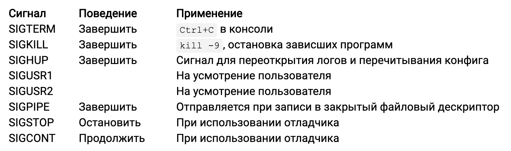

# Урок 12: Взаимодействие с ОС

## CLI флаги
### Пакет pflag
Улучшенная версия стандартного пакета _flag_ которая решает ряд недостатков:
* POSIX стиль флагов (`--flag` вместо гошного `-flag`)
* Однобуквенные сокращения (`--verbose` и `-v`)
* Можно отличать флаг без значения от незаданного (`--buf` от `--buf=1`)

Важное отличие при использовании одного дефиса:  
В пакете `flag` текст `-abc` это флаг `abc`  
В пакете `pflag` текст `-abc` это набор из трех флагов `a`, `b`, `c`.

```go
import flag "github.com/spf13/pflag"

// Указатель!
var ip *int = flag.Int("flagname", 1234, "Help message")

// Просто значения
var flagvar int
var verbose bool

func init() {
	flag.IntVar(&flagvar, "flagname", 123, "Help message")
	// Заметьте суфикс P в имени функции
	flag.BoolVarP(&verbose, "verbose", "v", true, "Help msg")
}

func main() {
	flag.Parse()
}
```

### Пакет cobra
Для более сложных CLI приложений иногда необходимо использовать команды и подкоманды:
```
git add file1 file2
git commit -m 123
aws s3 ls s3://bucket-name
```

Фреймворк Cobra (github.com/spf13/cobra) позволяет сильно упростить написание таких CLI.

## Layout CLI приложения
Расположение файлов:
```
appName
  - pkg
  - internal
	- cmd
		add.go
		your.go
		commands.go
	- main.go
```

Заметка: также есть более детальный шаблон проекта [Standard Go Project Layout](https://github.com/golang-standards/project-layout)

В основном файле `main.go` выполняется:
```go
package main

import "github.com/user/appName/cmd"

func main() {
	cmd.Execute()
}
```

Корневая команда обычно располагается в `appName/cmd/root.go`:
```go
var cfgFile, projectBase string

var rootCmd = &cobra.Command{
	Use: "hugo",
	Short: "Hugo is very fast static site generator",
	Run: func(cmd *cobra.Command, args []string) {
		// Основной код команды имеет смысл не раздувать...
	},
}

func init() {
	// Флаги для всех команд и подкоманд
	rootCmd.PersistentFlags().StringVar(&cfgFile, "config", ...)
	rootCmd.PersistentFlags().StringVarP(&projectBase, "base", )
}

func Execute() {
	if err := rootCmd.Execute(); err != nil {
		fmt.Println(err)
		os.Exit(1)
	}
}
```

Подкоманды располагаются в соответствующих файлах, например в `appName/cmd/add.go`:
```go
var source string

var addCmd = &cobra.Command{
	Use: "add",
	Short: "Adds some files to storage",
	Run: func(cmd *cobra.Command, args []string) {
		runAdd(cmd, args)
	},
}

func init() {
	addCmd.Flags().StringVarP(&source, "source", "s", "", "Source directory to read from")
	rootCmd.AddCommand(addCmd)
}
```

## Переменные окружения
```
# Запустить программу с дополнительной переменной env
$ NEWVAR=val myprog

# Запустить с чистым окружением и одной переменной
$ env -i NEWVAR myprog
```

```go
import (
	"os"
	"fmt"
)

func main() {
	var env []string
	env = os.Environ()      // слайс (!) строк
	fmt.Println(env[0])     // NEWVAR=val

	var newvar string
	newvar, ok := os.LookupEnv("NEWVAR")
	fmt.Printf(newvar)      // val

	os.Setenv("NEWVAR", "val2") // установить
	os.Unsetenv("NEWVAR")       // удалить
	// простейшая шаблонизация
	fmt.Printf(os.ExpandEnv("$USER have a ${NEWVAR}"))
}
```

## Использование внешних программ
Для запуска внешних программ используется пакет `os/exec`. Основной тип - `Cmd`:
```go
type Cmd struct {
	// Путь к запускаемой программе
	Path string
	// Аргументы командной строки
	Args []string
	// Переменные окружения (слайс!)
	Env []string
	// Рабочая директория
	Dir string
	// Поток ввода, вывода и ошибок для программы (/dev/null если nil!)
	Stdin io.Reader
	Stdout io.Writer
	Stderr io.Writer
	// ...
}

// Шорткат для создания Cmd
cmd := exec.Command("prog", "­­arg=1", "arg2")
```

По умолчанию, в запускаемую программу будут переданы все переменные окружения из текущей. Можно при помощи команды
`cmd.Env = []string{"QWE=1"}` передать только один параметр. Или же добавить к текущим еще один
`cmd.Env = append(os.Environ(), "QWE=1")`.

`cmd.Run()` запускает команду и дожидается её завершения:
```go
cmd := exec.Command("sleep", "1")
err := cmd.Run()
// ошибка запуска или выполнения программы
log.Printf("Command finished with error: %v", err)
```

`cmd.Start()` запускает программу, но не дожидается завершения
`cmd.Wait()` дожидается завершения

```go
err := cmd.Start()
if err != nil {
	log.Fatal(err) // ошибка запуска
}
log.Printf("Waiting for command to finish...")
err = cmd.Wait() // ошибка выполнения
log.Printf("Command finished with error: %v", err)
```

C помощью `cmd.Output()` можно получить STDOUT выполненной команды:
```go
out, err := exec.Command("date").Output()
if err != nil {
	log.Fatal(err)
}
fmt.Printf("The date is %s\n", out)
```
C помощью `cmd.CombinedOutput()` можно получить STDOUT и STDERR (cмешанные).

Как сделать аналог bash команды `ls | wc ­-l`?
```go
func main() {
	c1 := exec.Command("ls")
	c2 := exec.Command("wc", "­l")
	pipe, _ := c1.StdoutPipe()
	c2.Stdin = pipe
	c2.Stdout = os.Stdout
	_ = c1.Start()
	_ = c2.Start()
	_ = c1.Wait()
	_ = c2.Wait()
}
```

## Сигналы
Сигналы - механизм OS, позволяющий посылать уведомления программе в особых ситуациях. 



Некоторые сигналы, например `SIGTERM`, `SIGUSR1`, `SIGHUP`, можно игнорировать или установить обработчик.
Некоторые, например `SIGKILL`, обработать внутри приложения нельзя.

```go
import (
	"fmt"
	"os"
	"os/signal"
	"syscall"
)

func signalHandler(c <­chan os.Signal) {
	s := <­ c
	// TODO: handle
	fmt.Println("Got signal:", s)
}

func main() {
	c := make(chan os.Signal, 1)
	signal.Notify(c, syscall.SIGUSR1)
	signal.Ignore(syscall.SIGINT)
	go signalHandler(c) businessLogic()
}
```

## Работа с файловой системой
В пакете `os` содержится большое количество функций для работы с файловой системой.
```go
// изменить права доступа к файлу
func Chmod(name string, mode FileMode) error
// изменить владельца
func Chown(name string, uid, gid int) error
// создать директорию
func Mkdir(name string, perm FileMode) error
// создать директорию (вместе с родительскими)
func MkdirAll(path string, perm FileMode) error
// переименовать файл/директорию
func Rename(oldpath, newpath string) error
// удалить файл (пустую директорию)
func Remove(name string) error
// удалить рекурсивно rm -­rf
func RemoveAll(path string) error
```

## Временные файлы
Иногда бывает необходимо создать временный файл, для сохранения в нем данных.
```go
func main() {
	content := []byte("temporary file's content")
	// файл будет создан в os.TempDir
	// например /tmp/example­Jsm22jkn
	tmpfile, err := ioutil.TempFile("", "example­")
	if err != nil {
		log.Fatal(err)
	}
	defer os.Remove(tmpfile.Name()) // не забываем удалить
	if _, err := tmpfile.Write(content); err != nil {
		log.Fatal(err)
	}
	if err := tmpfile.Close(); err != nil {
		log.Fatal(err)
	}
}
```

[<< Предыдущая](11-formats.md) | [Оглавление](../readme.md) | [Следующая >>](13-reflection.md)
