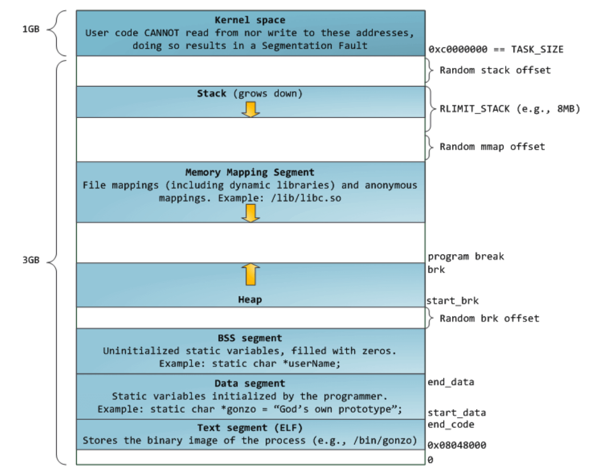
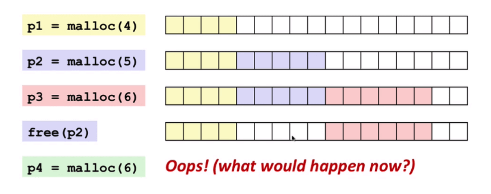
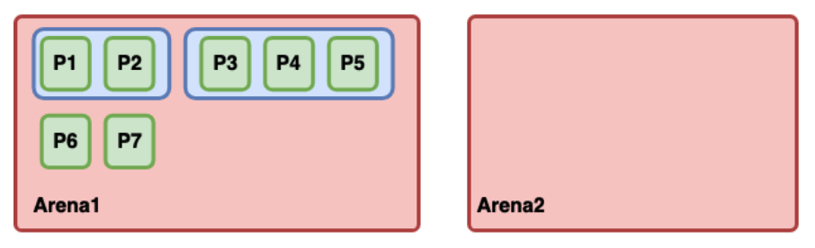
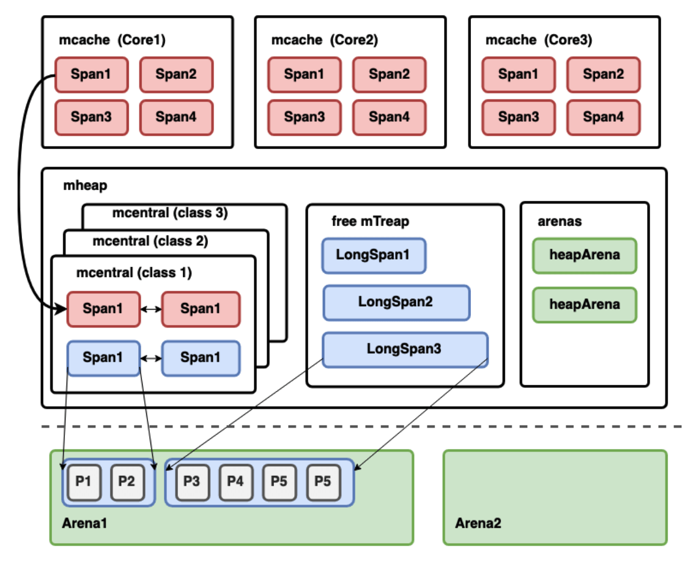
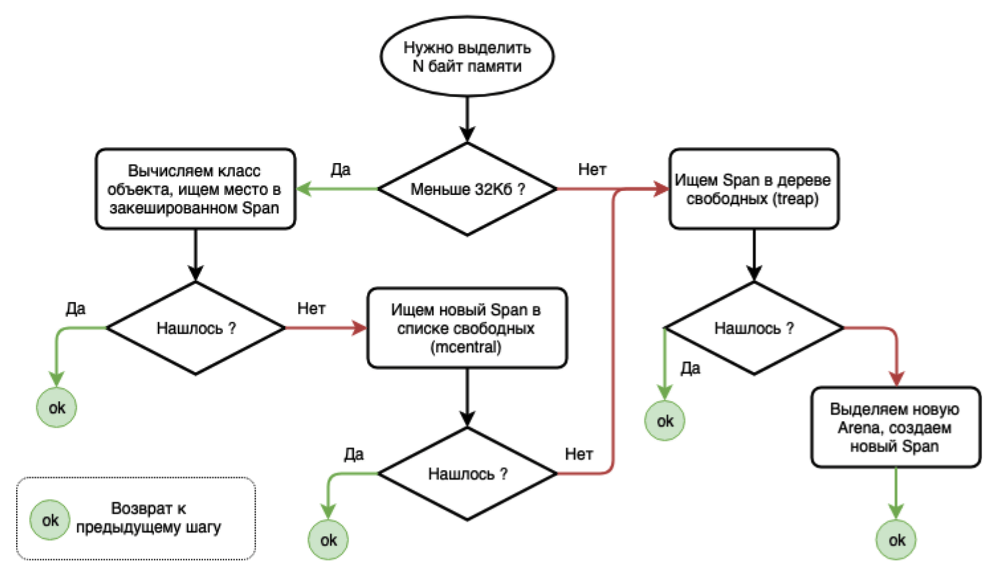

# Урок 15: Go Internals Memory

## Память процесса в Linux
Виртуальная память (англ. _virtual memory_) - метод  управления памятью компьютера, позволяющий выполнять программы,
требующие больше оперативной памяти, чем имеется в компьютере, путём автоматического перемещения частей программы
между основной памятью и вторичным хранилищем (например, жёстким диском). Для выполняющейся программы данный метод
полностью прозрачен и не требует дополнительных усилий со стороны программиста. В виртуальной памяти для каждого
процесса нумерация ячеек начинается с нуля и маппится на адрес ячейки реальной памяти.



Первый (старший) гигабайт памяти выделен под операционную систему. Обычные процессы при попытке обратиться к ней
получат ошибку Segmentation Fault. Процессам память выделяется определенными минимальными блоками - страницами,
имеющими размер 4Kb. Если процесс попросит выделить ОС 1Гб памяти, то система выделит ему этот объем, но реально
резервировать в физической памяти не будет до тех пор, пока процесс не начнет ее использовать.

Виртуальная память не однородна. Она состоит из сегментов, в каждом из которых содержатся данные определенного вида:

### Text segment (ELF)
По сути это cкомпилированый код самой программы. Исполняемый файл с диска загружается в память.

### Data segment
Здесь находятся глобальные переменные, т.е. те, которые были объявлены вне функций. Но которые имею объявленные значения.

### BSS segment
Также хранятся глобальные переменные, но не имеющие значений при инициализации.

### Stack
Стек растет «вниз», т.е. в сторону уменьшения адресов. В нем хранятся локальные переменные функций.

### Heap («куча»)
Heap растет «вверх», на встречу стеку. Это область памяти предназначенная для создания долго живущих объектов. Примером
таких объектов являются результаты работы функций, которые передаются из одной в другую. Системный вызов `brk` позволяет
увеличит размер «кучи».

### Memory Mapping Segment
Фича позволяющая маппить адресные пространства памяти, например на файл или другую область памяти. Таким образом
при обращении к определённому адресу в памяти будет выдаваться содержимое из файла. Применяется при помощи системного
вызова `mmap`.

В Linux есть специальная файловая система `proc`, которая позволяет получить информацию о запущенных процессах по их PID.
В частности файлики `maps` покажут маппинг виртуальной памяти процесса:
```
$ cat /proc/5913/maps | tac

ffffffffff600000-­ffffffffff601000 r­xp 00000000 00:00 0 [vsyscall]
7ffeb2fb2000­7-ffeb2fb4000 r­xp 00000000 00:00 0 [vdso]
7ffeb2faf000­7-ffeb2fb2000 r­­p 00000000 00:00 0 [vvar]
7ffeb2f39000­7-ffeb2f5a000 rw­p 00000000 00:00 0 [stack]
7f2e908f9000­7-f2e908fa000 rw­p 00000000 00:00 0
...
7f2e906ca000­7-f2e906cc000 rw­p 001eb000 09:02 130089146 /lib/x86_64­linux­gnu/libc­2.27.so
7f2e906c6000­7-f2e906ca000 r­­p 001e7000 09:02 130089146 /lib/x86_64­linux­gnu/libc­2.27.so
...
7f2e8d6af000­7-f2e900c0000 rw­p 00000000 00:00 0
7f2e8d6ae000­7-f2e8d6af000 ­­­p 00000000 00:00 0
…
7f2dc0021000­7-f2dc4000000 ­­­p 00000000 00:00 0
7f2dc0000000­7-f2dc0021000 rw­p 00000000 00:00 0
c000e00000­-c004000000 rw­p 00000000 00:00 0
c000800000­-c000e00000 rw­p 00000000 00:00 0
c000000000­-c000800000 rw­p 00000000 00:00 0
02ca4000­0-2cc5000 rw­p 00000000 00:00 0 [heap]
00d57000-­00d7a000 rw­p 00000000 00:00 0
00d1f000­-00d57000 rw­p 0091f000 09:02 127405274 /usr/local/bin/mysync
00842000-­00d1f000 r­­p 00442000 09:02 127405274 /usr/local/bin/mysync
00400000-­00842000 r­xp 00000000 09:02 127405274 /usr/local/bin/mysync
```

Более подробно: [Как Linux работает с памятью](https://www.youtube.com/watch?v=bhdkFPGhxfI)

## Особенности памяти в Go
1. Использование множества горутин потребует множество мелких стеков, располагающихся в «куче».
2. Автоматическое управление памятью: есть механизм аллокации и сборки мусора. А запрос памяти у ОС происходит
большими фрагментами (arena).
3. Go использует очень небольшие стеки (2Kb) для горутин. Поэтому перед вызовом функций производится проверка
и увеличение стека при необходимости. Память под стек выделяется в той же «куче». Данные из старого стека будут
скопированы в новый.

Почитать: [Механизмы выделения памяти в Go](https://habr.com/ru/company/ruvds/blog/442648/)

## Проблема выделения памяти в «куче»
Существует 2 основных проблемы (см. рисунок):
1. **Фрагментация памяти**. Если у нас освободились блоки, которых в сумме достаточно для новой алокации,
но последовательно такую память выделить не получается. Например, есть блоки по 5 и 2 байт, а необходимо выделить
блок размером 6 байт.
2. **Оптимальное выделение памяти**. Например, нам необходимо выделить маленький блок размером в 2 байта. Но где
именно это будет наиболее оптимально.



Проблемы решается следующим образом:
* Память у ОС запрашивается большими кусками `Arena` = 64Mb (Linux)
* Внутри `Arena` память разбивается на фиксированные страницы `Page` = 8Kb
* Подряд идущие страницы объединяются в интервалы `Span` различной длинны



В таких `Span` хранится основная информация. Однако помимо этого Go также хранит некоторую Meta-информацию.
В виде специальных структур в ней описано, к примеру, где начинается и заканчивается та или иная `Arena`.



Для каждой области `Arena` создается структура с мета-информацией:
```go
// runtime/mheap.go
type heapArena struct {
	// битовая карта указателей в арене
	bitmap [heapArenaBitmapBytes]byte
	// карта принадлежности страниц конкретным Span­ам
	spans [pagesPerArena]*mspan
	// карта, показывающая какие Span в состоянии Used
	pageInUse [pagesPerArena / 8]uint8
	// для GC
	pageMarks [pagesPerArena / 8]uint8
}
```

`Span` разделяются на классы в зависимости от того, какого размера объекты в них размещаются, а также наличия
указателей внутри объекта (scan/noscan). Очень крупные `Span` размером свыше 10Mb не классифицируются:
```go
// runtime/sizeclasses.go
// class bytes/obj bytes/span objects  tail waste  max waste
// 1 	   8         8192       1024     0    		  87.50%
// 2     16        8192       512      0          43.75%
// 3     32        8192       256      0          46.88%
// ...
// 33    1280      8192       6        512        15.55%
// 34    1408      16384      11       896        14.00%
// 35    1536      8192       5        512        14.00s
// ...
// 64    27264     81920      3        128        10.00%
// 65    28672     57344      2        0          4.91%
// 66    32768     32768      1        0          12.50%
```

`Span` в зависимости от класса может хранить объекты только определенного типа. Например, для 1-го класса размер
объекта должен быть 8 байт (см. код выше).

Для каждого класса `Span`  с фиксированным размером существует центральный кэш `mcentral` (см. рисунок выше).
В нем находятся 2 списка `Span` - свободные и занятые. Свободные это те, в которых еще есть место для выделения памяти.

`Span` больших размеров хранятся в отдельной структуре `mTreap` (по сути внутри бинарное дерево).

Для каждого выделенного `Span` также есть структура (не все поля!!):
```go
// runtime/mheap.go
type mspan struct {
	next *mspan         // следующий span в списке
	prev *mspan         // предыдущий

	startAddr uintptr	// начало адресуемой памяти
	npages uintptr		// количество 8Кб страниц
	nelems uintptr		// количество «объектов» в span
	allocCount uint16	// количество «выделенных» объектов
	elemsize uintptr	// размер «объекта» в span
	limit uintptr		// конец адресуемой памяти

	allocBits *gcBits	// (*uint8) карта выделенных объектов
	gcmarkBits *gcBits	// (*uint*) карта отметок для GC
	spanclass spanClass // класс span, типовой размер объекта
	...
}
```

А также для каждого ядра процессора существуют свой собственный локальный кэш со `Span` обозначенный на рисунке
как `mcache`, в котором есть по одному `Span` каждого типа. Во время работы данные будут писаться в `Span`
соответствующего типа, который находится в локальном кэше. Если `Span` будет заполнен, то он вернется в `mheap`,
а оттуда обратно будет назначен новый пустой `Span`.

Каждый локальный кэш завязан на свое ядро процессора и их не нужно синхронизировать между собой. Также это позволяет
не тратить время на блокировки (mutex). Они нужный только в `heap`. Это позволяет горутинам (в большинстве случаев)
выделять память без обращения к общей куче и без блокировок.

Общий алгоритм выделения памяти выглядит так:


Алгоритм освобождения:
* В какой-то момент времени в занятом `Span` освобождается место
* Возвращаем `Span` в соответствующий список свободных `mheap.central[cls].mcentral.nonempty`
* Если `Span` полностью свободен, пытаемся соединить с соседними (`coalesce`) и возвращаем в дерево свободных `mheaf.free`

ToDo: Доразобрать лекцию

[<< Предыдущая](14-code-generation.md) | [Оглавление](../readme.md) | [Следующая >>](17-profiling.md)
