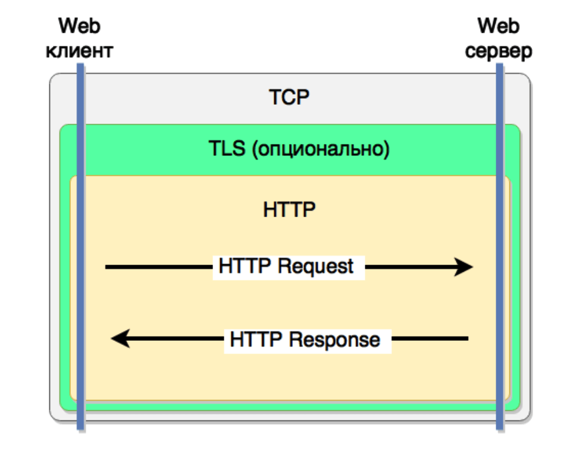

# Урок 21: HTTP библиотека

**HTTP** - синхронный текстовый протокол передачи документов между клиентом и сервером. Изначально разработан
для передачи web страниц, сейчас используется так же как протокол для API.



Задачи HTTP:
* Передача документов
* Передача мета-информации
* Авторизация
* Поддержка сессий
* Кеширование документов
* Согласование содержимого (negotiation)
* Управление соединением

Ключевые особенности протокола:
* Работает поверх TCP/TLS
* Протокол запрос-ответ
* Не поддерживает состояние (соединение) - stateless
* Текстовый протокол
* Расширяемый протокол

HTTP/2:
* бинарный протокол
* используется мультиплексирование потоков
* сервер может возвращать еще не запрошенные файлы
* используется HPACK сжатие заголовков

## HTTP-клиент: GET запрос
```go
import (
	"net/http"
	"net/url"
)

// создаем HTTP клиент
client := &http.Client{}

// строим нужный URL
reqArgs := url.Values{}
reqArgs.Add("query", "go syntax")
reqArgs.Add("limit", "5")
reqUrl, _ := url.Parse("https://site.ru")
reqUrl.Path = "/search"
reqUrl.RawQuery = reqArgs.Encode()

// создаем GET-запрос
req, err := http.NewRequest("GET", reqUrl.String(), nil)

// выполняем запрос
req.Header.Add("User-Agent", `Mozilla/5.0 Gecko/20100101 Firefox/39.0`)
resp, err := client.Do(req)
```

При отправке запросов по https-протоколу, в системе где запускается бинарник должны быть установлены сертификаты.
Если это какой-либо внешний ресурс, то будет достаточно корневых сертификатов (обычно они всегда есть в ОС).
В случае если будет вестись работа с какими-то внутренними ресурсами в рамках кластера, то необходимо также
обеспечить доступ к сертификатам этого кластера.

При использовании docker-контейнеров на базе scratch (чистое ядро) нужно копировать сертификаты при сборке образа
([пример](https://github.com/rumyantseva/paris/blob/master/Dockerfile)):
```
COPY /etc/ssl/certs/ca-certificates.crt /etc/ssl/certs/
```

## HTTP-клиент: POST запрос
```go
type AddRequest struct {
	Id int `json:"id"`
	Title string `json:"title"`
	Text string `json:"text"`
}

// создаем HTTP клиент
client := &http.Client{}

// Запрос в виде Go структуры
addReq := &AddRequest{
	Id: 123,
	Title: "for loop",
	Text: "...",
}

// Создаем буфер (io.Reader) из которого клиент возьмет тело запроса
var body bytes.Buffer
json.NewEncoder(body).Encode(addReq)

// создаем POST-запрос
req, err := http.NewRequest("POST", "https://site.ru/add_item", body)

// выполняем запрос
resp, err := client.Do(req)
```

## HTTP-клиент: обработка ответа
```go
// Выполняем запрос
// Если вернется ошибка, то это будет ошибка в транспорте
resp, err := client.Do(req)
if err != nil {
	// или другая уместная обработка
	log.Fatal(err)
}

// если ошибки не было - намнеобходимо «закрыть» тело ответа
// иначе при повторном запросе будет открыто новое соединение
defer resp.Body.Close()

// проверяем HTTP status ответа
if resp.StatusCode != 200 {
	// обработка HTTP статусов зависит от приложения
	return fmt.Errorf("unexpected http status: %s", resp.Status)
}

// возможно проверяем какие-то заголовки
ct := resp.Header.Get("Content-Type")
if ct != "application/json" {
	log.Fatalf("unexpected content-type: %s", ct)
}

// считываем тело ответа (он может быть большим)
body, err := ioutil.ReadAll(resp.Body)
```

## HTTP-клиент: context
Контекст в Go - это объект ограничивающий время выполнения запрос (кода) и/или предоставляющий контекстную
информацию (например trace id) запроса. Если у вас уже есть некоторый контекст:
```go
func (h *MyHandler) DoSomething(ctx context.Context) error {
	// создаем запрос
	req, _ := http.NewRequest(http.MethodGet, "https://site.ru/some_api", nil)

	// теперь запрос будет выполняться в рамках сtx
	req = req.WithContext(ctx)

	// выполняем запрос
	resp, err := h.client.Do(req)
	// ...
}
```

Есть просто необходимо ограничить время выполнения запроса:
```go
// создаем новый контекст
ctx := context.Background()
ctx, cancel := context.WithTimeout(ctx, 3 * time.Second)
defer cancel()

// теперь запрос будет выполняться в рамках сtx
req = req.WithContext(ctx)
// выполняем запрос
resp, err := client.Do(req)
```

## HTTP-клиент: настройка
Внутри `http.Client` поддерживается пул соединений, т.е:
* одно HTTP соединение будет использовано повторно
* при необходимости будет открыто новое HTTP соединение
* `http.Client` безопасен для конкурентного доступа.

Настроить пул соединений и другие параметры можно с помощью `http.Transport`:
```go
transp := &http.Transport{
	// Максимальное кол-во соединений в пуле
	MaxIdleConns: 10,
	// Максимальное время простоя соединения в пуле
	IdleConnTimeout: 30 * time.Second,
	// Использование сжатия
	DisableCompression: true,
}
client := &http.Client{Transport: transp}
```

## HTTP-сервер
```go
type MyHandler struct {
	// все нужные вам объекты: конфиг, логер, соединение с базой и т.п.
}

// реализуем интерфейс `http.Handler`
func (h *MyHandler) ServeHTTP(resp http.ResponseWriter, req *http.Request) {
	if req.URL.Path == "/search" {
		// разбираем аргументы
		args := req.URL.Query()
		query := args.Get("query")
		limit, err := strconv.Atoi(args.Get("limit"))
		if err != nil {
			panic("bad limit")
			// по-хорошему нужно возвращать HTTP 400
		}

		// выполняем бизнес-логику
		results, err := DoBusinessLogicRequest(query, limit)
		if err != nil {
			resp.WriteHeader(404)
			return
		}

		// устанавливаем заголовки ответа
		resp.Header().Set("Content-Type", "application/json; charset=utf-8")
		resp.WriteHeader(200)
		// сериализуем и записываем тело ответа
		json.NewEncoder(resp).Encode(results)
	}
}

func main() {
	// создаем обработчик
	handler := &MyHandler{}
	// создаем HTTP сервер
	server := &http.Server{
		Addr: ":8080",
		Handler: handler,
		ReadTimeout: 10 * time.Second,
		WriteTimeout: 10 * time.Second,
		MaxHeaderBytes: 1 << 20,
	}
	// запускаем сервер, это заблокирует текущую горутину
	server.ListenAndServe()
}
```

С помощью типа `http.HandlerFunc` вы можете использовать обычную функцию в качестве HTTP-обработчика (обертка):
```go
// функция с произвольным именем
func SomeHttpHandler(resp http.ResponseWriter, req *http.Request) {
	// ...
}

func main() {
	// ...
	// создаем HTTP сервер
	server := &http.Server{
		Addr: ":8080",
		Handler: http.HandlerFunc(SomeHttpHandler),
		ReadTimeout: 10 * time.Second,
		WriteTimeout: 10 * time.Second,
		MaxHeaderBytes: 1 << 20,
	}
}
```

## HTTP-сервер: роутинг
```go
type MyHandler struct {}
func (h *MyHandler) Search(resp ResponseWriter, req *Request) {
	// ...
}
func (h *MyHandler) AddItem(resp ResponseWriter, req *Request) {
	// ...
}

func main() {
	handler := &MyHandler{}
	// создаем маршрутизатор запросов
	mux := http.NewServeMux()
	mux.HandleFunc("/search", handler.Search)
	mux.HandleFunc("/add_item", handler.AddItem)
	// создаем и запускаем HTTP сервер
	server := &http.Server{
		Addr: ":8080",
		Handler: mux,
	}
	log.Fatal(server.ListenAndServe())
}
```

## HTTP-сервер: middleware
**Middleware** - функция, преобразующая один обработчик в другой:
```go
func (s *server) adminOnly(h http.HandlerFunc) http.HandlerFunc {
	return func(resp http.ResponseWriter, req *http.Request) {
		if !currentUser(req).IsAdmin {
			http.NotFound(resp, req)
			return
		}
		h(resp, req)
	}
}

func main() {
	handler := &MyHandler{}
	// создаем маршрутизатор запросов
	mux := http.NewServeMux()
	mux.HandleFunc("/search", handler.Search)
	// !!! мы обернули один из обработчиковв middleware 
	mux.HandleFunc("/add_item", adminOnly(handler.AddItem))
}
```

Типовые задачи для middleware:
* Авторизация
* Проверка доступа
* Логирование
* Сжатие ответа
* Трассировка запросов в микросервисах

### Пример middleware: ограничение времени запроса:
```go
func (h *MyHandler) Search(resp ResponseWriter, req *Request) {
	ctx := req.Context()
	// ...
	// мы должны передавать контекст вниз по всем вызовам
	results, err := DoBusinessLogicRequest(ctx, query, limit)
	// ...
}

func withTimeout(h http.HandlerFunc, timeout time.Duration) http.HandlerFunc {
	return func(resp http.ResponseWriter, req *http.Request) {
	// берем контекст запроса и ограничиваем его таймаутом
	ctx := context.WithTimeout(req.Context(), timeout)
	// обновляем контекст запроса
	req = req.WithContext(ctx)
	h(resp, req)
	}
}

mux := http.NewServeMux()
mux.HandleFunc("/search", withTimeout(handler.Search, 5 * time.Second))
```

### Пример middleware: авторизация
```go
func (h *MyHandler) AddItem(resp ResponseWriter, req *Request) {
	ctx := req.Context()
	user := ctx.Value("currentUser").(*MyUser)
	// ...
}

func authorize(h http.HandlerFunc, timeout time.Duration) http.HandlerFunc {
	return func(resp http.ResponseWriter, req *http.Request) {
		// выполняем авторизацию пользователя
		user, err := DoAuthorizeUser(req)
		if err != nil {
			// если не удалось - возвращаем 403 HTTP статус
			resp.WriteHeader(403)
			return
		}

		// сохраняем пользователя в контекст
		ctx := context.WithValue(req.Context(), "currentUser", user)
		req = req.WithContext(ctx)
		h(resp, req)
	}
}

mux := http.NewServeMux()
mux.HandleFunc("/add_item", authorize(handler.AddItem))
```

## Полезные ссылки
* [[EN] Классный урок про использование контекста](https://github.com/campoy/justforfunc/tree/master/09-context)
* [[RU] Доклад про использование GraphQL в Go](https://youtu.be/tv8muwgj-Y4)
* [[EN] Про дизайн клиента и middleware](https://youtu.be/SlhG7bCRA6Q)

[<< Предыдущая](20-tcp-udp-dns.md) | [Оглавление](../readme.md) | [Следующая >>](22-grpc.md)
