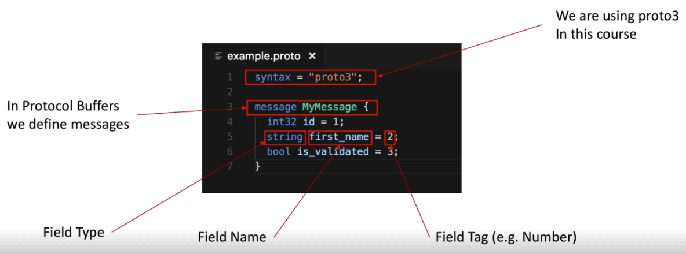
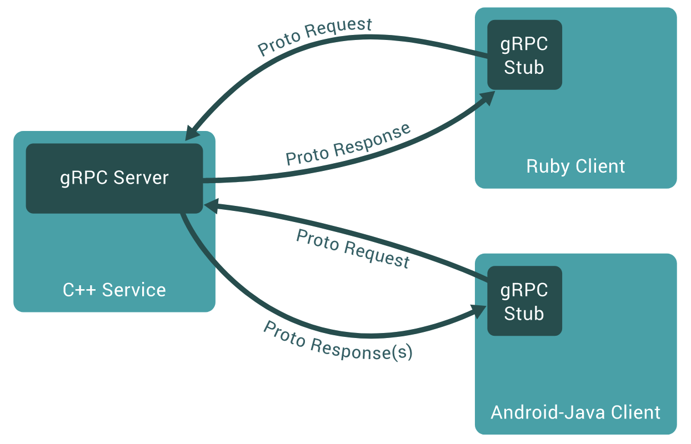
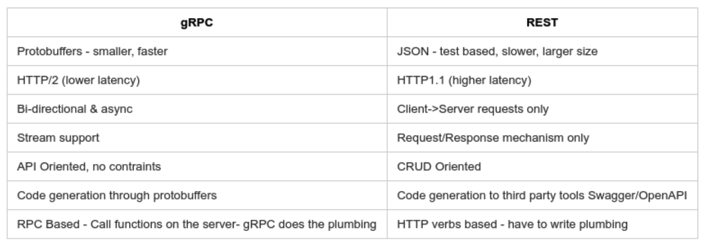
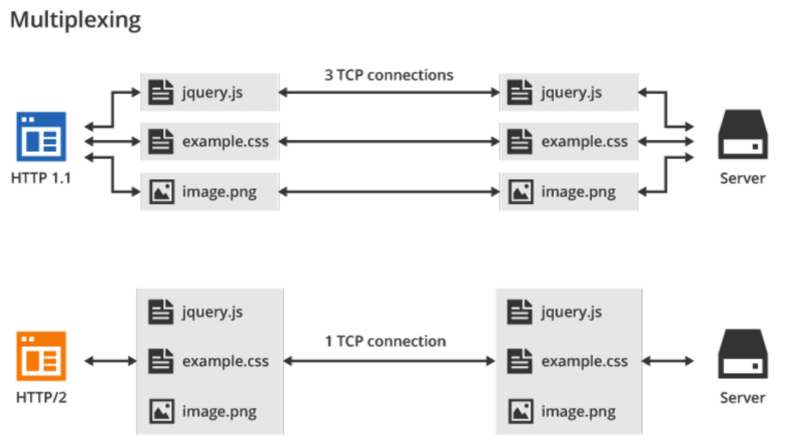
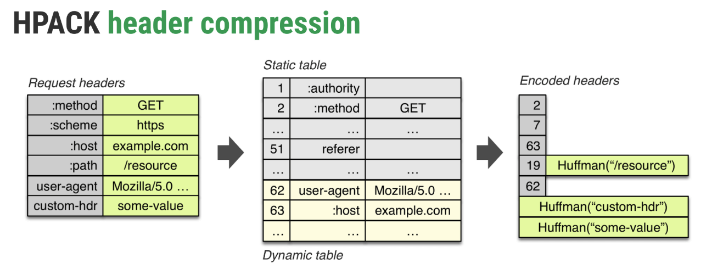
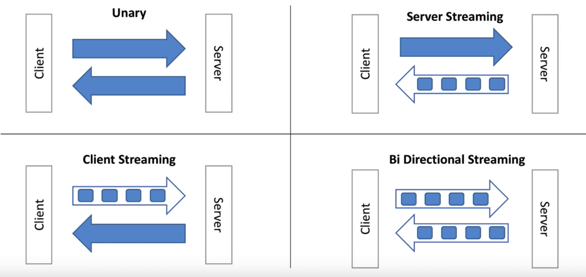

# Урок 22: GRPC

**RPC (Remote Procedure Call)**:
* сетевые вызовы абстрагированы от кода
* интерфейсы как сигнатуры функций (Interface Definition Language для language-agnostic)
* тулзы для кодогенерации 
* кастомные протоколы

Что значит «g» в gRPC: [G stands for](https://github.com/grpc/grpc/blob/master/doc/g_stands_for.md)

Пример protobuf-файла:
```protobuf
syntax = "proto3";

service Google {
	// Search returns a Google search result for the query
	rpc Search(Request) returns (Result) { }
}

message Request {
	string query = 1;
}

message Result {
	string title = 1;
	string url = 2;
	string snippet = 3;
}
```

Protobuf работает не с названиями полей, а именно с тегами. Поэтому мы можем спокойно переименовывать поля.



Для генерации go-файла по protobuf используем команду:
```
protoc ./search.proto --go_out=plugins=grpc:.
```

В результате получаем:
```go
type GoogleClient interface {
	// Search returns a Google search result for the query
	Search(ctx context.Context, in *Request, opts ...grpc.CallOption) (*Result, error)
}

type GoogleServer interface {
	// Search returns a Google search result for the query
	Search(context.Context, *Request) (*Result, error)
}

type Request struct {
	Query string `protobuf:"bytes,1,opt,name=query" json:"query,omitempty"`
}

type Result struct {
	Title string `protobuf:"bytes,1,opt,name=title" json:"title,omitempty"`
	Url string `protobuf:"bytes,2,opt,name=url" json:"url,omitempty"`
	Snippet string `protobuf:"bytes,3,opt,name=snippet" json:"snippet,omitempty"`
}
```

### Где использовать gRPC
* микросервисы
* клиент-сервис (например в мобильных приложениях)
* интеграции / API



### gRPC vs REST


## HTTP vs HTTP/2
* Детальное описание от Гугла: [Fundamentals: HTTP/2](https://developers.google.com/web/fundamentals/performance/http2/)
* Отличия HTTP от HTTP/2: [статья на Medium](https://medium.com/@factoryhr/http-2-the-difference-between-http-1-1-benefits-and-how-to-use-it-38094fa0e95b)
* Небольшая демка: [HTTP vs HTTP/2](https://imagekit.io/demo/http2-vs-http1)

Основные особенности HTTP/2:
1. Бинарный протокол вместо текстового
2. Мультиплексирование - передача нескольких асинхронных HTTP-запросов по одному TCP-соединению
3. Сжатие заголовков методом HPACK
4. Server Push - передача нескольких ответов на один запрос
5. Приоритизация запросов ([статья на Хабре](https://habr.com/ru/post/452020/))

### Мультиплексирование
Для передачи файлов теперь нет необходимости открывать под каждый новое TCP-соединение. Все файлы будут отправлены
в одном потоке (stream) + есть возможность выставить какие файлы в каком порядке загружать (см. приоритизацию запросов).



### Сжатие заголовков HPACK
Заголовки не передаются повторно. Вместо этого передаются только идентификаторы уже переданных заголовков:



## Protobuf: типы данных
Существует несколько скалярных типов данных, которые мапятся на Go'шные типы ([подробнее про все типы данных](https://developers.google.com/protocol-buffers/docs/encoding)):
* float: float32
* double: float64
* bool: bool
* string: string (UTF-8 / 7-bit ASCII)
* bytes: []byte
* int{32,64} (отрицательные значения - 10 байт)
* uint{32,64}
* sint{32,64} (оптимальнее для данных с разными знаками, использует ZigZag для отрицательных значений)

## Protobuf: теги
Следует помнить о некоторых особенностях тегов:
1. Допустимы значения от 1 до 2^29 (536 870 911)
2. Теги от 1 до 15 занимают всего 1 байт. Поэтому их разумно применять для часто используемых полей
3. Теги с 19000 до 19999 зарезервированы для имплементации Protocol Buffers

## Protobuf: repeated fields
Работа со слайсами реализуется при помощи repeated fields:
```protobuf
message SearchResponse {
	repeated Result results = 1;
}
message Result {
	string url = 1;
	string title = 2;
	repeated string snippets = 3;
}

// Snippets []string `protobuf:"bytes,3,rep,name=snippets,proto3" json:"snippets,omitempty"`
// Results []*Result `protobuf:"bytes,1,rep,name=results,proto3" json:"results,omitempty"`
```

## Protobuf: дефолтные значения
* string: пустая строка
* number (int{32,64} etc): 0
* bytes: пустой массив
* enum: первое значение
* repeated: пустой массив
* Message: nil для Go ([подробнее](https://developers.google.com/protocol-buffers/docs/reference/go-generated#singular-message))

## Protobuf: enums
При указании первого значения для enum рекомендуется использовать либо дефолтное значения для бизнеса, либо значение «неизвестное» (unknown). Это связано с особенностями передачи дефолтных значений в Protobuf.

```protobuf
enum EyeColor {
	UNKNOWN_EYE_COLOR = 0;
	EYE_GREEN = 1;
	EYE_BLUE = 2;
}
message Person {
	string name = 1;
	repeated string phone_numbers = 2;
	EyeColor eye_color = 3;
}
```

## Protobuf: импорты и пакеты
У нас есть возможность выносить общие сообщения (messages) в отдельные файлы и использовать их повторно.
А также опционально можно указывать наименование пакета, чтобы избежать конфликта в названии полей при импорте.
Также можно при помощи `go_package` указать наименование пакета для Go.
```protobuf
// date.proto
package my.date;
option go_package = "my_date";
message BirthDate {
	int32 year = 1;
	int32 month = 2;
	int32 day = 3;
}


// person.proto
import "date.proto"
message Person {
	string name = 1;
	my.date.BirthDate birthday = 2;

	message Address {
		string street = 1;
		string city = 2;
		string country = 3;
	}
	Address address = 3;
}
```

## Protobuf: oneof, map
**oneof** - только одно поле из списка может иметь значение и не может быть repeated:
```protobuf
message Message {
	int32 id = 1;
	oneof auth {
		string mobile = 2;
		string email = 3;
		int32 userid = 4;
	}
}
```

**map** - ассоциативный массив, ключи - скаляры (кроме float/double) значения - любые типы, не может быть repeated:
```protobuf
message Result {
	string result = 1;
}
message SearchResponse {
	map<string, Result> results = 1;
}
```

## Protobuf: Well known types
В гугловском пакете есть [некоторые типы](https://developers.google.com/protocol-buffers/docs/reference/google.protobuf),
которых не хватает в скалярных типах данных:
```protobuf
import "google/protobuf/timestamp.proto";
import "google/protobuf/duration.proto";

message MyMessage {
	google.protobuf.Timestamp last_online = 1;
	google.protobuf.Duration session_length = 2;
}
```

## Передача ошибок в gRPC
Сервисы могут передавать ошибки при обработке запросов. Для этого рекомендуется использовать обертки из пакета gRPC
при отправке ошибки в ответе (ошибка конвертируется из гошного формата в gRPC):
```go
import "google.golang.org/grpc"
import "google.golang.org/grpc/codes"
import "google.golang.org/grpc/status"

// Your service
	return nil, status.Error(codes.InvalidArgument, "Not allowed empty text")
```

А на стороне получателя полученную ошибку мы должны обратно конвертировать из grpc формата в гошный:
```go
status.Convert(err)
```

## Evans: универсальный gRPC клиент
Удобная утилита для работы с gRPC и отладки:
[ktr0731/evans: Evans: more expressive universal gRPC client](https://github.com/ktr0731/evans)

## Прямая и обратная совместимость
Основные правила (более детально описано в [документации](https://developers.google.com/protocol-buffers/docs/proto#updating)):
* Не меняйте теги
* Старый код будет игнорировать новые поля
* При неизвестных полях используются дефолтные значения
* Поля можно удалять, но не переиспользовать тег / добавить префикс `OBSOLETE_` / сделать поле `reserved`

**Добавление полей**
```protobuf
message MyMessage {
	int32 id = 1;
	+ добавим string fist_name = 2;
}
```
Старый код будет игнорировать новое поле. Новый код будет использовать дефолтное значение при чтении «старых» данных.

**Переименование полей**
```protobuf
message MyMessage {
	int32 id = 1;
	- fist_name = 2;
	+ person_first_name = 2;
}
```
Бинарное представление не изменится, т.к. имеет значение только тег.

**Reserved поля**
```protobuf
message Foo {
	reserved 2, 15, 9 to 11;
	reserved "foo", "bar";
}
```
Мы можем резервировать как поля, так и теги. Но смешивать нельзя. Резервируем теги чтобы новые поля их
не переиспользовали (runtime error). А имена полей резервируем, чтобы избежать багов.

**Никогда** не удаляйте зарезервированные теги.

## Style Guide
Полное описание style guide для Protobuf: [Style Guide](https://developers.google.com/protocol-buffers/docs/style)
Основные аспекты:
* Максимальная длина строки 80, отступы 2 пробела
* Имена файлов в формате lower_snake_case.proto
* Сообщения в формате CamelCase, а поля - underscore_separated_names
* Названия для Enums: CAPITAL_WITH_UNDERSCORE

## Типы gRPC API


Пример реализации различных типов gRPC API: [grpc-streams.zip](../extra/grpc-streams.zip)

[<< Предыдущая](21-http.md) | [Оглавление](../readme.md)
